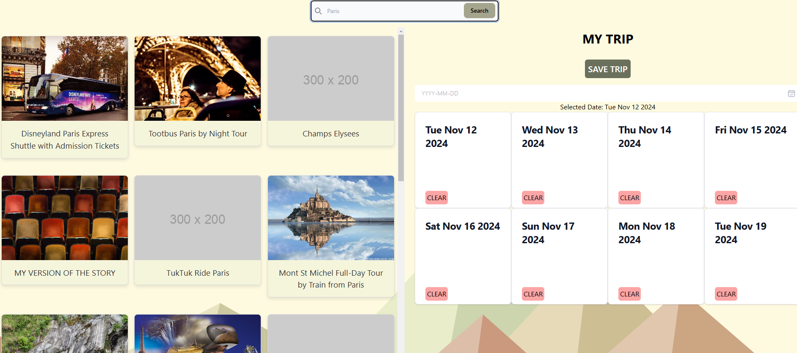

# LOCUS

## Description

Let us plan your next trip for you!
Locus is a web application that provides an easy-to-use and intuitive travel planning experience. Users can create accounts, log in, and plan trips using information by dragging and dropping attractions of interest onto a calendar. Users can save trips to their account, view existing trips, and delete trips as well.

## Usage

Go [here](https://locus-qslj.onrender.com/) to check it out.

Click "get started" to get started.

## Features:

- Create accounts, log in, and log out.
- Create trip on the trip creator page. Search for cities by name; a list of attractions will be generated on the left-hand side of the page! Adding them to your trip is as easy as dragging and dropping them. You can change the date by clicking the datepicker component under the "save trip" button. Save the trip to your account whenever you're done.
- View existing trips. From here, you can click on trips you've created to view the details, and delete trips.

## Credits

- [Landing page template](https://tailwindflex.com/@limaa-m/basic-hero-secction)
- [Image on landing page provided by Undraw](https://undraw.co/search)
- [Tutorial for creating custom form validation for login and signup forms](https://dev.to/deyemiobaa/adding-custom-validation-to-a-form-with-tailwindcss-1e7d)
- [Background SVG](https://www.svgbackgrounds.com/set/free-svg-backgrounds-and-patterns/)

## License

This project is covered under the MIT license. For more information, click the badge at the top of the profile or the file entitled LICENSE.
